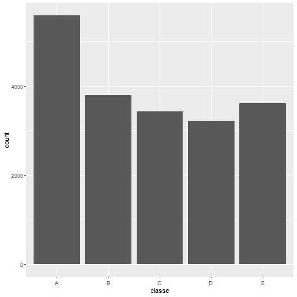
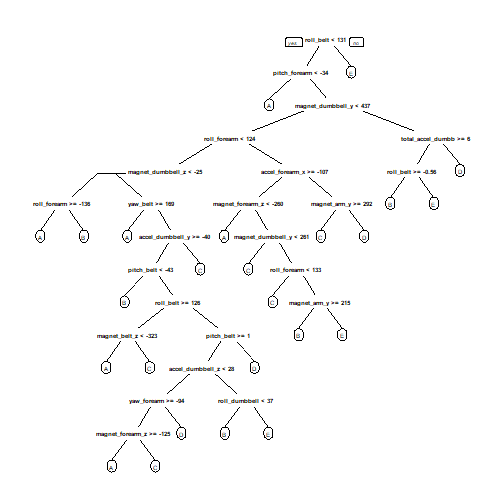

# Overview  
Using devices such as Jawbone Up, Nike FuelBand, and Fitbit it is now possible to collect a large amount of data about personal activity relatively inexpensively. These type of devices are part of the quantified self movement – a group of enthusiasts who take measurements about themselves regularly to improve their health, to find patterns in their behavior, or because they are tech geeks. One thing that people regularly do is quantify how much of a particular activity they do, but they rarely quantify how well they do it. In this project, your goal will be to use data from accelerometers on the belt, forearm, arm, and dumbell of 6 participants. They were asked to perform barbell lifts correctly and incorrectly in 5 different ways. More information is available from the website here: http://web.archive.org/web/20161224072740/http:/groupware.les.inf.puc-rio.br/har (see the section on the Weight Lifting Exercise Dataset).  

#Preprocessing  

Download data from repository.  


```r
download.file('https://d396qusza40orc.cloudfront.net/predmachlearn/pml-training.csv', 'pml_train.csv')
download.file('https://d396qusza40orc.cloudfront.net/predmachlearn/pml-testing.csv', 'pml_test.csv')
```

Load in csv files.  

```r
train <- read.csv('pml_train.csv')
test <- read.csv('pml_test.csv')
```

load necessary packages. 


```r
library(caret)
library(stats)
library(dplyr)
library(ggplot2)
library(randomForest)
library(rpart)
library(rpart.plot)
```
# Exploratory Analysis  


```r
dim(train)
```

```
## [1] 19622   160
```

```r
ggplot(train, aes(x=classe)) + geom_histogram(stat = 'count')
```

```
## Warning: Ignoring unknown parameters: binwidth, bins, pad
```



Remove NA and columns without data. This changes the datasets from train being 19622 by 87 to 19622 by 53, and test from being 20 by 54 to 20 by 53. The datasets are equal which is need for further analysis and validation.  


```r
train <- train[, colSums(is.na(train)) == 0]
test <- test[, colSums(is.na(test)) == 0]
classe <- train$classe
trainRemove <- grepl("^X|timestamp|window", names(train))
train <- train[, !trainRemove]
trainCleaned <- train[, sapply(train, is.numeric)]
trainCleaned$classe <- classe
testRemove <- grepl("^X|timestamp|window", names(test))
test<- test[, !testRemove]
testCleaned <- test[, sapply(test, is.numeric)]
```

set seed and split training set into train and test.  


```r
set.seed(22519)
inTrain <- createDataPartition(train$classe, p=.7, list = F)
trainData <- trainCleaned[inTrain,]
testData <- trainCleaned[-inTrain,]
```

# Model Building

First let us look at a tree model and visualize it.  


```r
treefit <- rpart(classe ~ ., data=trainData, method="class")
prp(treefit)
```



The dendrogram shows the possible iterations of the data and the relationship between actions and the classe grade for each.  

Next let's run our actual analysis with cross validation. The following creates a control set plus the model using the random forest model.  


```r
crossv_rf <- trainControl(method = 'cv', 5)
model_rf <- train(classe ~ ., data = trainData, method = 'rf', trControl=crossv_rf, ntree = 250)
model_rf
```

```
## Random Forest 
## 
## 13737 samples
##    52 predictor
##     5 classes: 'A', 'B', 'C', 'D', 'E' 
## 
## No pre-processing
## Resampling: Cross-Validated (5 fold) 
## Summary of sample sizes: 10990, 10991, 10988, 10990, 10989 
## Resampling results across tuning parameters:
## 
##   mtry  Accuracy   Kappa    
##    2    0.9904632  0.9879354
##   27    0.9913368  0.9890413
##   52    0.9827463  0.9781726
## 
## Accuracy was used to select the optimal model using the largest value.
## The final value used for the model was mtry = 27.
```

# Cross Validation


```r
predict_rf <- predict(model_rf, testData)
confusionMatrix(testData$classe, predict_rf)
```

```
## Confusion Matrix and Statistics
## 
##           Reference
## Prediction    A    B    C    D    E
##          A 1671    1    2    0    0
##          B    5 1129    4    1    0
##          C    0    4 1019    3    0
##          D    0    0    9  955    0
##          E    0    0    4    2 1076
## 
## Overall Statistics
##                                           
##                Accuracy : 0.9941          
##                  95% CI : (0.9917, 0.9959)
##     No Information Rate : 0.2848          
##     P-Value [Acc > NIR] : < 2.2e-16       
##                                           
##                   Kappa : 0.9925          
##                                           
##  Mcnemar's Test P-Value : NA              
## 
## Statistics by Class:
## 
##                      Class: A Class: B Class: C Class: D Class: E
## Sensitivity            0.9970   0.9956   0.9817   0.9938   1.0000
## Specificity            0.9993   0.9979   0.9986   0.9982   0.9988
## Pos Pred Value         0.9982   0.9912   0.9932   0.9907   0.9945
## Neg Pred Value         0.9988   0.9989   0.9961   0.9988   1.0000
## Prevalence             0.2848   0.1927   0.1764   0.1633   0.1828
## Detection Rate         0.2839   0.1918   0.1732   0.1623   0.1828
## Detection Prevalence   0.2845   0.1935   0.1743   0.1638   0.1839
## Balanced Accuracy      0.9982   0.9967   0.9901   0.9960   0.9994
```


```r
acc <- postResample(predict_rf, testData$classe)
acc
```

```
##  Accuracy     Kappa 
## 0.9940527 0.9924773
```

As the number show we have about a 99% accuracy in the model for predicting the grade of activity shown.  

# Out of Sample Error

The following checks the Out of Sample Error for the model.  

```r
out_of_sample_error <- 1 - as.numeric(confusionMatrix(testData$classe, predict_rf)$overall[1])
out_of_sample_error
```

```
## [1] 0.005947324
```

WE have an out of sample error of around 0.7%

# Test Set Prediciton

Finally we can apply our model to the test set given in the assignment.  

```r
result <- predict(model_rf, testCleaned[, -length(names(testCleaned))])
result
```

```
##  [1] B A B A A E D B A A B C B A E E A B B B
## Levels: A B C D E
```


